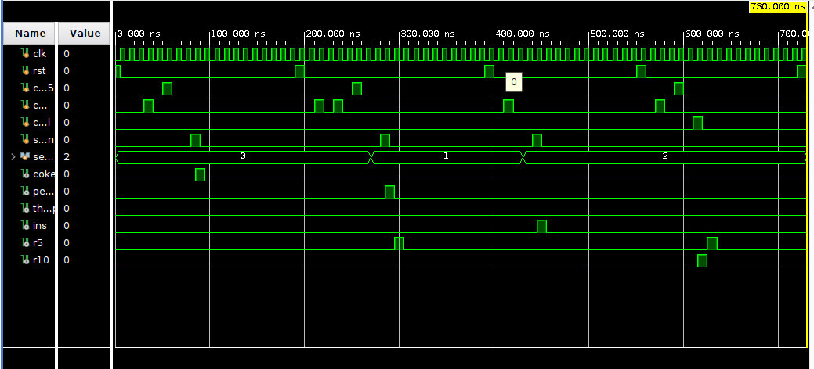

# Smart_Bevarage_Vending_Machine_FSM 🚀

## 📌 Description
SmartVend FSM is a Verilog-based vending machine implemented using a Finite State Machine (FSM). It accepts ₹5 and ₹10 coins, allows product selection, dispenses beverages, returns change, and supports cancel operation. The design is verified using a simulation testbench.

---

## ⚙️ Features
- Accepts ₹5 and ₹10 coins  
- Supports 3 products:
  - Coke (₹15)
  - Pepsi (₹20)
  - ThumsUp (₹25)
- Handles:
  - ✅ Exact payment
  - ✅ Extra payment with change return
  - ✅ Insufficient balance detection
  - ✅ Cancel operation
- Edge detection for reliable input handling  
- Clean FSM design (IDLE, COLLECT, DISPENSE, RETURN)

---

## 🧠 FSM States
- **IDLE** → Waits for coin insertion  
- **COLLECT** → Accumulates balance  
- **DISPENSE** → Dispenses selected product  
- **RETURN** → Returns remaining change  

---
## 📁 Project Structure

```text

vending-machine-fsm/
│
├── vending_fsm.v              # RTL Design (FSM vending machine)
├── vending_fsm_tb.v           # Testbench for simulation
├── README.md                  # Project documentation
├── LICENSE                    # MIT License 
├── .gitignore                 # Ignores Vivado/temp files
│
└── images/                    # Waveform screenshots
    ├── waveform.png          # It contains output waveforms of all test cases
                                Test 1: Exact payment → Coke dispensed
                                Test 2: Extra payment → Change returned
                                Test 3: Insufficient balance → no dispense
                                Test 4: Cancel transaction → full return

  ├── simulation_log.txt         # TCL console output

```

---

## 🧪 Simulation
The design is verified using a testbench with multiple scenarios:
- Exact payment (₹15 → Coke)  
- Extra payment (₹25 → Pepsi + ₹5 return)  
- Insufficient balance  
- Cancel transaction  

---

## 📊 Waveform Results




---
## 🧾 TCL Console Output
Full simulation logs are available in `simulation_log.txt`

---

## 🚀 How to Run
1. Open project in simulator (Vivado / ModelSim)  
2. Compile:
   - vending_fsm.v  
   - vending_fsm_tb.v  
3. Run simulation  
4. Observe outputs and waveforms  

---

## 🛠️ Tools Used
- Verilog HDL  
- Xilinx Vivado Simulator  

---

## 📌 Key Concepts
- Finite State Machine (FSM)  
- Edge Detection  
- Sequential & Combinational Logic  
- Digital System Design  

---

## 📜 License
This project is licensed under the MIT License.

---

## 👨‍💻 Author
**SHAIK ABDUL MATHEEN**

---

## ⭐ Acknowledgement
This project was developed as part of learning digital design and FSM implementation.
